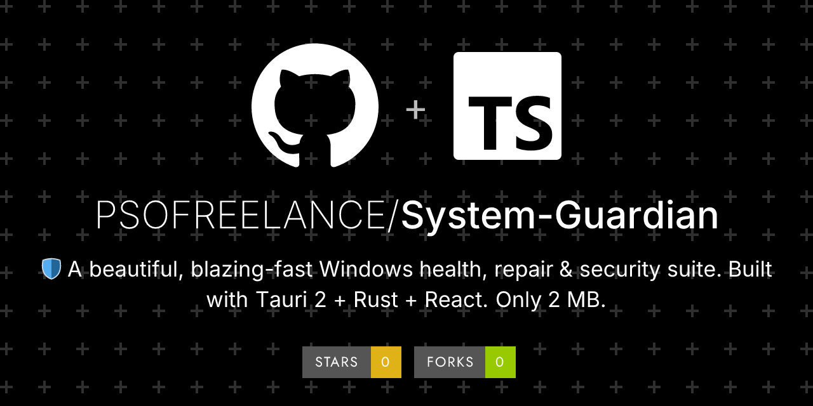
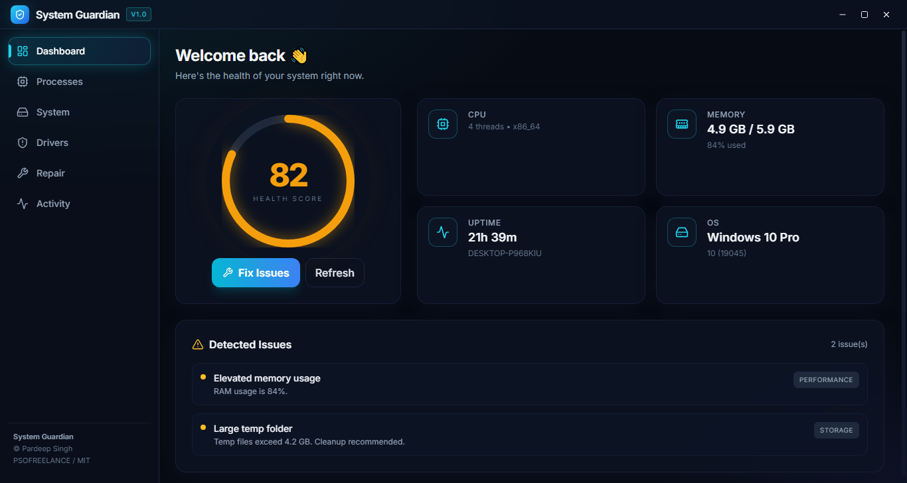
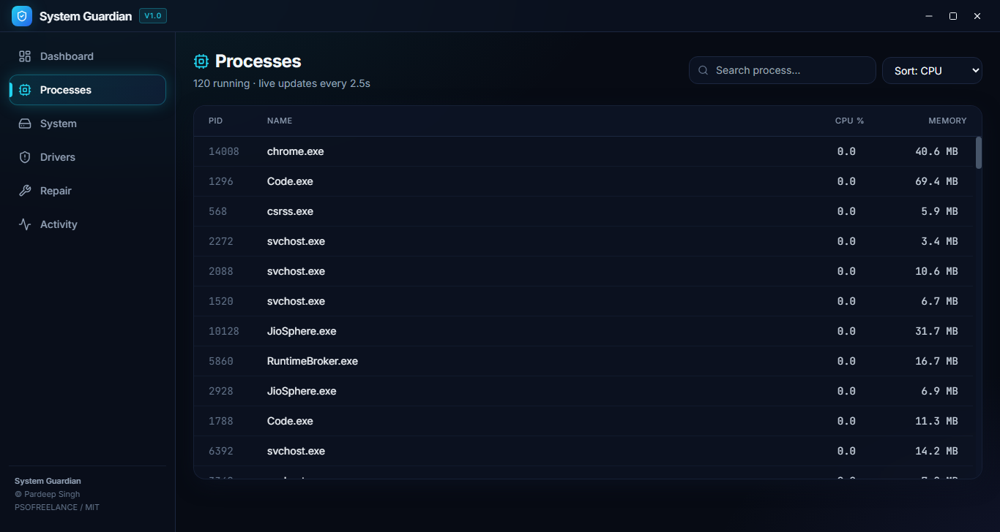
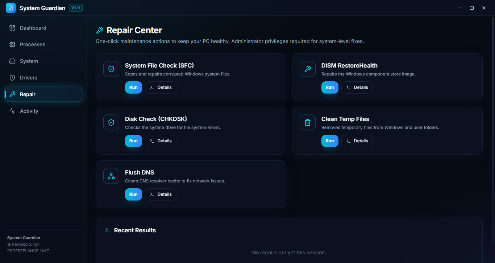
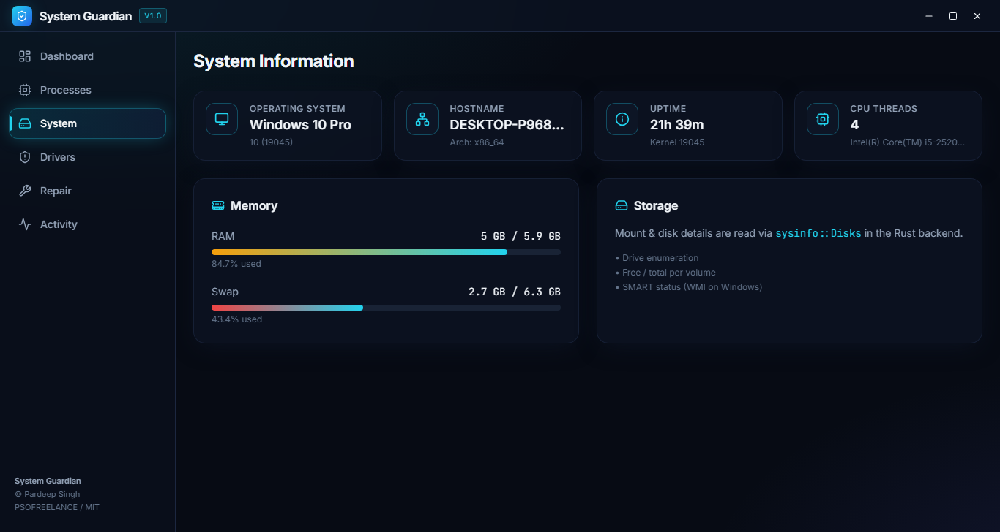
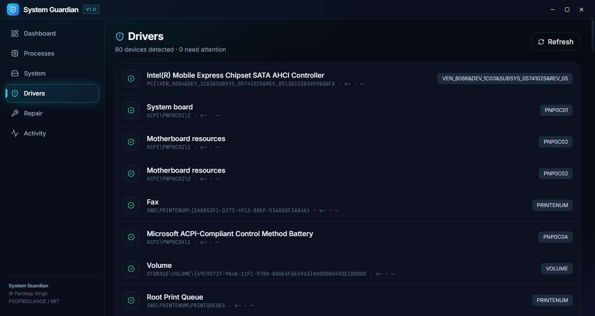
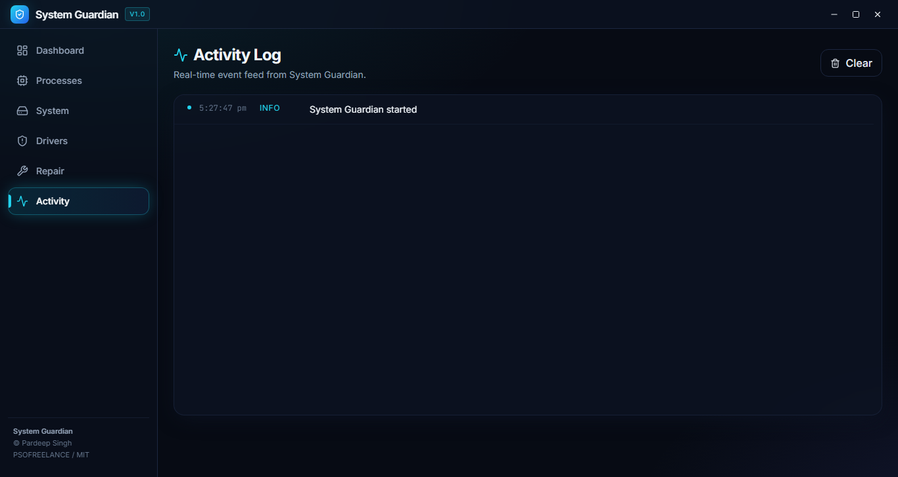

<div align="center">
  
</div>

<div align="center">


<div align="center">

# 🛡️ System Guardian

**A beautiful, blazing-fast Windows health, repair & security suite.**

**Only 2 MB · 100% local · MIT licensed**
Built with **Tauri 2 · Rust · React · TypeScript · Tailwind**

[](https://github.com/PSOFREELANCE/System-Guardian/releases/latest)
[](https://github.com/PSOFREELANCE/System-Guardian/actions)
[](LICENSE)
[]()

</div>

## 📸 Screenshots

<div align="center">

### Dashboard


### Process Monitor


### Repair Center


### System Audit


### Drivers Center


### Activity


</div>

## ✨ Features

- 🩺 **Live Health Score** — animated gauge showing system health at a glance
- 🧠 **Smart Diagnostics** — memory, disk, temp files, uptime, security checks
- ⚙️ **One-Click Repairs** — SFC, DISM, CHKDSK, temp cleanup, DNS flush
- 🚗 **Driver Inspector** — enumerate PnP devices & flag problem devices
- 🔒 **Security Audit** — Defender, Firewall, BitLocker, Secure Boot
- 📊 **Live Process Monitor** — top CPU/memory consumers
- 📝 **Activity Log** — real-time event stream
- 🌙 **Glassmorphic dark UI** — modern, minimal, gorgeous

## 🖥️ Supported Platforms

- Windows 8.1 / 10 / 11 (32-bit & 64-bit) and newer
- Linux & macOS (read-only diagnostics)

## 🚀 Getting Started

### Prerequisites
- [Node.js 20+](https://nodejs.org/)
- [Rust (stable)](https://rustup.rs/)
- Windows: [WebView2](https://developer.microsoft.com/microsoft-edge/webview2/)

### Install & run
```bash
git clone https://github.com/PSOFREELANCE/System-Guardian.git
cd System-Guardian
npm install
npm run tauri:dev